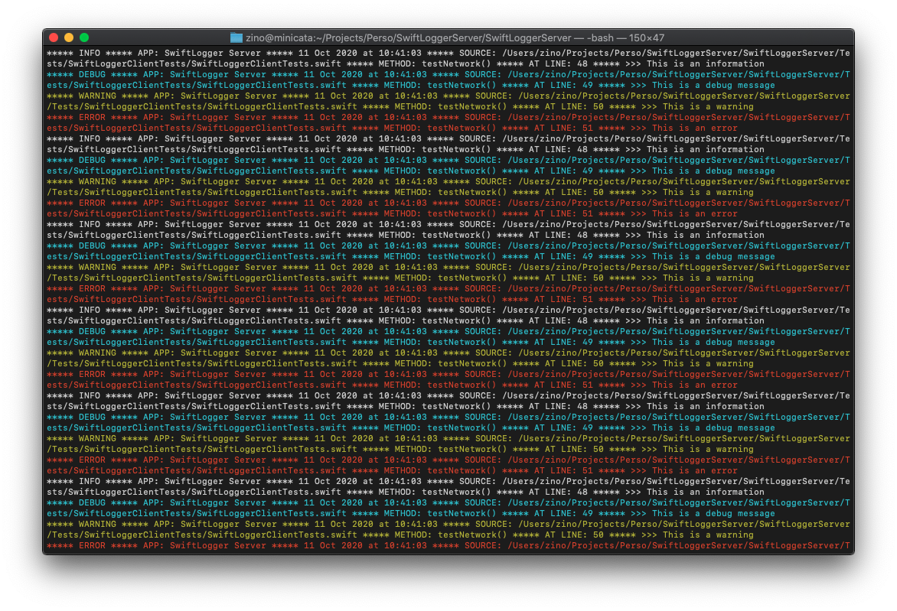

# Swift Logger

Swift logger utility collection including a server (http and bonjour/zeroconf), and a client library.



## Credits

Based on an original idea and implementation by [MLaden-K](https://github.com/Mladen-K/Swift-Logger-Server).  
Most of the code has been rewritten, but it should be backwards compatible with the original implementation.

I used the older version to debug serverless actions, and decided it would be a good idea to update it for modern times (`Network.framework` among other things), and keep the same licence (MIT).

## Architecture

The idea is to have a logging server on a different machine (à la [NSLogger](https://github.com/fpillet/NSLogger)) that is as hassle-free as possible.

- [SwiftLoggerServer](Docs/SwiftLoggerServer/): Starts a CLI server (see [Server](#Server) for usage)
- [SwiftLoggerClient](Docs/SwiftLoggerClient/): Embed in your app to start logging to remote servers (See [Client](#Client) for usage)
- [SwiftLoggerRouter](Docs/SwiftLoggerRouter/): Embed the server in an app (as in the companion app)
- [SwiftLoggerCommon](Docs/SwiftLoggerCommon/): Common files for every other target

Yes, [Kitura](https://github.com/Kitura/Kitura) is kind of in a limbo after IBM suspended development, but I still vastly prefer it to other solutions, and it's good enough to handle a single POST route.

## Server

> Swift Logger API has only one endpoint - /logger that expects request with the header [Content-Type: application/json] and body of a request containing JSON representation of following struct object:

> ```swift
> struct LoggerData: Codable {
>     let appName: String
>     let logType: String
>     let logTarget: String
>     let sourceFile: String
>     let lineNumber: Int
>     let function: String
>     let logText: String
> }
> ```
> 
> Example JSON representation of request body:
> ```json
> {
>     "appName": "My Application",
>     "logType": "DEBUG",                 
>     "logTarget": "terminal",
>     "sourceFile": "main.swift",
>     "lineNumber": 10,
>     "function": "errorHandler()",
>     "logText": "Some arbitrary message"
> }
> ```
> 
> Available values for logType key are: "DEBUG", "INFO", "WARNING" & "ERROR"
> Available values for logTarget key are: "terminal", "file", or "both"
> 
> (from the original documentation)

The `Network.framework` implementation uses Zeroconf/Bonjour to broadcast its existance and (lightly) crypts data going to the server. It is only available on Apple platforms (Mac OS, iOS, iPadOS, and tvOS).

### CLI Usage

```
USAGE: swift-logger-server [--port <port>] [--data-dir <data-dir>] [--file-logging] [--no-file-logging] [--ui-logging] [--no-ui-logging] <mode>

ARGUMENTS:
  <mode>                  The network mode to run (http|network). Please be aware that network mode is only available on Apple platforms 

OPTIONS:
  -p, --port <port>       The port to run on (defaults to 8080) 
  -d, --data-dir <data-dir>
                          The path of the directory to write logs to (defaults to ./data) 
  -f, --file-logging/--no-file-logging
                          Writes log to disk (default: false)
  -u, --ui-logging/--no-ui-logging
                          Writes log to UI (default: true)
  -h, --help              Show help information.
```

Just run `swift run SwiftLoggerServer` from the root of the package to start a server with the default options (port 8080, console logging, no file logging). On a Mac, you will *need* to specify if you want the `http` or the `network` variants. On Linux, no argument is needed, as only the `http` variant is available.

### Caveats

- the server starts an unencrypted http stack. Put it behind a proxy with SSL forwarding if you want to grab logs over the Internet
- the http route is *purposefully* open to older/different implementations. You might want to secure it with a token or something in production
- the `Network` stack uses Apple's bonjour implementation which might or might not be available in WAN mode depending on your setup. Make sure you're on the same network, just in case

### Docker 

As my day job is fairly time-intensive, I do not plan on maintaining a docker image. If you want to start the server in a container, make sure the dependencies are met:

```
$ docker run -it -p 8080:8080 -v $PWD:/app swift:latest bash
# apt-get update
...
# apt-get install -y libssl-dev libcurl4-openssl-dev
...
# cd /app
# swift run SwiftLoggerServer [your options]
...
Started listening on port [your port, 8080 by default]
***
```

## Client

Mostly hassle-free logging is implemented, but it's based on my usage rather than a deep reflection upon the soul-searching nature of a developer in need of a logging solution. 😅

### SPM dependency

#### Xcode

Just add this package as you normally would.

#### Package.swift

Add the following to your dependencies:

```swift
.package(name: "SwiftLogger", url: "https://gitlab.krugazor.eu/logger/swiftloggerserver", from: "1.0.0"),

```

Add the client to your target's dependencies:

```swift
        .target(
            name: "Whatever",
            dependencies: [
              ...your other dependencies..., 
              .product(name: "SwiftLoggerClient", , package: "SwiftLogger")
            ]),

```

### Usage

Simply import the framework

```swift
import SwiftLoggerClient
```

At the appropriate time, configure it (see [the relevant functions in the documentation](Docs/SwiftLoggerClient/classes/SwiftLogger.md))

```swift
SwiftLogger.setupForHTTP(URL(string: "http://logserver.local:8080")!, appName: "Test")
```

or

```swift
SwiftLogger.setupForNetwork(passcode: LoggerData.defaultPasscode, 
                             appName: "Test", 
                   useSpecificServer: false)

```

And now use the functions to log to the server

```swift
SwiftLogger.i(message: "This is an information")
SwiftLogger.d(message: "This is a debug message")
SwiftLogger.w(message: "This is a warning")
SwiftLogger.e(message: "This is an error")
SwiftLogger.i(data: somedata, fileExtension: "png")
SwiftLogger.d(data: somedata, fileExtension: "json")
SwiftLogger.w(data: somedata, fileExtension: "jpg")
SwiftLogger.e(data: somedata) // will use .bin as extension
```

More information regarding the function parameters that are set by default can be found [in the documentation for text mesages](Docs/SwiftLoggerClient/classes/SwiftLogger.md) or [in the documentation for data messages](Docs/SwiftLoggerClient/extensions/SwiftLogger.md)

## Prerequisites

### Swift
* Open Source Swift 5.0.0 or higher

### macOS
* macOS Sierra 10.15.0 or higher
* Xcode Version 11.0 or higher

### Linux
* Ubuntu 16.04 & above (only tested in docker)


## License
[MIT Licence](/LICENSE)
